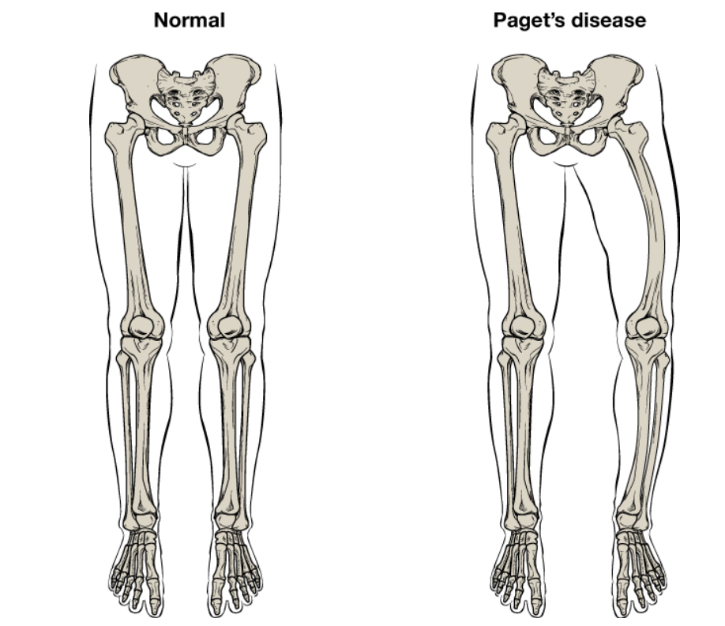
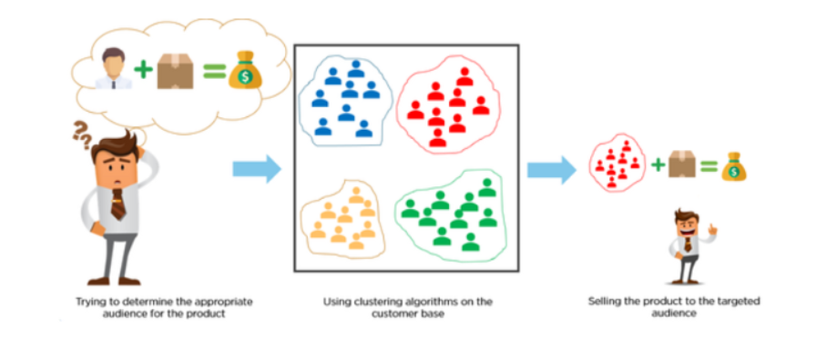

# Data Science Portfolio
On this page, I will present some of the best Data Science Projects that I have been working on. I have been exploring various machine-learning algorithms such as:

- Linear Regression
- Logistic Regression
- Bagging and Boosting ensemble model:
- K-means clustering
- PCA 
- NLP
- Deep Neural Networks
         
    
I like to understand and compare the results to see which machine-leaning algorithms are appropriate for a particular type of problem.

Feel free to contact me to learn more about my experience working with these projects and ask question about anything that is not clear.

***

[Examining the effect of environmental factors and weather on Bike rentals](https://github.com/MarceloD02/Marcelo-Goncalves-Portfolio/blob/main/projects/Lenear_project1final.ipynb)

- Used Linear Regression to predict the number of bikes rented in the city of Seoul
- The data had quite a few categorical variables which were encoded for use in the model
- Encoded categorical variables to numeric using Sklearn due to the presence of many string columns
- Fit a multiple linear regression model with high prediction accuracy through iteration

***

[Predict if the client will subscrebe a term deposit or not](projects/Projects/Final_project_LR.ipynb)

- In this project the idea is to used logistic regression to predict if the client will subscrebed a term deposit or not.
- by using data releted a marketing company(phones calls) of a portugues bank institution BPI.

***

[Identifying symptoms of orthopedic patients as normal or abnormal](projects/KNN_Project.ipynb)

- Used the K Nearest Neighbours algorithm to classify a patient's condition as normal or abnormal based on various orthopedic parameters
- Compared predictive performance by fitting a Naive Bayes model to the data
- Selected best model based on train and test performance

***

[Predict the probability of a click being fraud or not in a chiness company (TalkingData)](projects/Desision_tree)

TalkingData is a Chinese big data company, and one of their areas of expertise is mobile advertisements.

In mobile advertisements, click fraud is a major source of losses. Click fraud is the practice of repeatedly clicking on an advertisement hosted on a website with the intention of generating revenue for the host website or draining revenue from the advertiser.

The idea for solving these problem is to generated a blacklist of IP addresses - IPs which produce lots of clicks, but never install any apps. Now, they want to try some advanced techniques to predict the probability of a click being genuine/fraud.

In this problem, we will use the features associated with clicks, such as IP address, operating system, device type, time of click etc. to predict the probability of a click being fraud.

 [The idea in this project is to predict the housing price in the Ames Lowa by using Principal Component Analyses PCA](projects/PCA_project.ipynb)
 
 

 In this Project, the idea is to use The San Francisco database of the salary and benefits paid to City employees since fiscal year 2013 to predict the payment in that year.
 for this project the idea is to use clustering algorithms, K-Means and Hierarchical clustering to predict the better result 

(https://github.com/MarceloD02/Machine_learnig_Projects/blob/main/Unsupervisor_learning/Kmean_project.ipynb)

 
 
 
[Amazon Fine Food Reviews](projects/)
 This project is about determine if a review is positive or negative. The data that I Will is about Amazon Fine Food Review Analysis and this data span a period of 10 years and it's include ~500,000 reviews up to October 2012. For the analyses I will considere Score/Rating. where A rating of review of 1 or 2 is considered negative,A rating of review of 4 or 5 could be cosnidered a positive review.A review of 3 is nuetral and ignored
 
 
  

[Recognising Handwritten numbers using Neural Networks]

