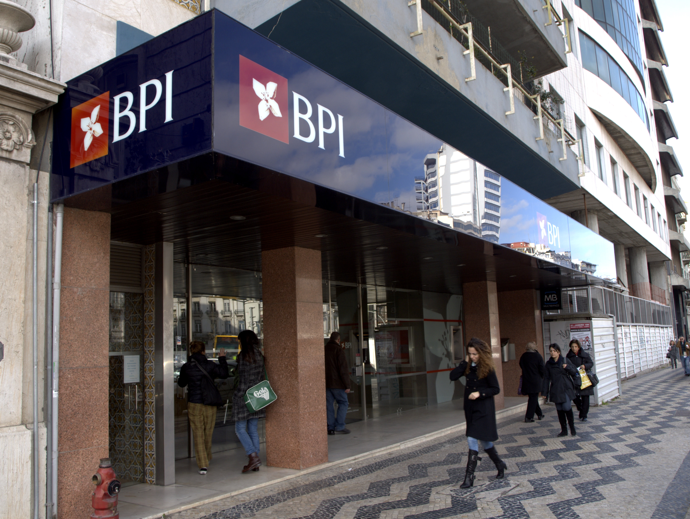

# Data Science Portfolio
On this page, I will present some of the best Data Science Projects that I have been working on. I have been exploring various machine-learning algorithms such as:

- Linear Regression
- Logistic Regression
- Bagging and Boosting ensemble model
- Principle Component Analysis (PCA)  
- K-means clustering
     
I like to understand and compare the results to see which machine-leaning algorithms are appropriate for a particular type of problem.

Feel free to contact me to learn more about my experience working with these projects and ask question about anything that is not clear.

***

[Examining the effect of environmental factors and weather on Bike rentals](https://github.com/MarceloD02/Marcelo-Goncalves-Portfolio/blob/main/projects/Lenear_project1final.ipynb)

<b>Skills used:</b> Python,Numpy, Pandas, Matplotlib, Seaborn, Sklearn, Logistic Regression

<b>Project objctive: </b> By predicting the bike rental demand in advance from weather forecast, Bike Rental Company position the bike according to customers demands resulting in increase in bike utilization.

<b>Quantifiable Result:</b> We could predict the rentals resulting in 46% accuracy and 134% increase in bike utiliation.

   - Used Linear Regression to predict the number of bikes rented in the city of Seoul
   - The data had quite a few categorical variables which were encoded for use in the model
   - Encoded categorical variables to numeric using Sklearn due to the presence of many string columns
   - Fit a multiple linear regression model with high prediction accuracy through iteration

***

[Predict if the client will subscrebe a term deposit ](https://github.com/MarceloD02/Logistic-regression/blob/0283b8832fb96a28bd4215e4398425b3b7d44017/Final_project_LR.ipynb)

<b>Skills used:</b> Python,Numpy, Pandas, Matplotlib, Seaborn, Sklearn, Logistic Regression

<b>Project objctive: </b> In this project the idea is to used logistic regression to predict if the client will subscrebed a term deposit or not by using data releted a            marketing company(phones calls) of a portugues bank institution BPI from UCI .

<b>Quantifiable Result:</b> Used Logistic regression classifier got 91.20 % of model accuracy which helps the bank to estimate their depositors in advance

   - Used logistic regression to explore and make note of attributes information 
   - Use data cleaning principles to get rid of the unwanted data
   - Explore data with groupby function and analyzing it
   - Used Logistic regression classifier to improve on the data to make better prediction on whether the client will subcribe or not
   - Explored a machine learning approach to predict by using Sklearn numeric

[Identifying symptoms of orthopedic patients as normal or abnormal](projects/KNN_Project.ipynb)

<b>Skills used:</b> Python,Numpy, Pandas, Matplotlib, Seaborn, Sklearn, K Nearest Neighbours

<b>Project objctive: </b> In this project the idea is to used logistic regression to predict if the client will subscrebed a term deposit or not by using data releted a            marketing company(phones calls) of a portugues bank institution BPI from UCI .

<b>Quantifiable Result:</b> Used the K Nearest Neighbours algorithm to classify a patient's condition as normal or abnormal based on various orthopedic parameters and got accuracy of 83.87 % for KNN and 82.26 % for NB

   - Compared predictive performance by fitting a Naive Bayes model to the data 
   - Selected best model based on train and test performance
   - Tuned hyperparameter best score was 0.8586
   - The accuracy of the KNN with K = 17 is 83.87%
   - The accuracy of the NB is 82.26%
   
***

[Predict the probability of a click being fraud or not in a chiness company (TalkingData)](projects/Desision_tree)

<b>Skills used:</b> Python,Numpy, Pandas, Matplotlib, Seaborn, Sklearn, Decision Tree, XGBCLassifier, XGBOOSTClassifier

<b>Project objctive: </b> The idea for solving these problem is to generated a blacklist of IP addresses - IPs which produce lots of clicks, but never install any apps. Now, they want to try some advanced techniques to predict the probability of a click being genuine/fraud

<b>Quantifiable Result:</b> Got highest accuracy of 99.81 % with XGBOOST classifier which helps the chinese mobile advertising company to classify the clicks

   - Explored the dataset anomolies and missing values
   - Used the necessary techniques to get rid of the apps that very rare (comprised of less than 20% clicks), plotted the rest
   - Divided the data into training and testing subsets (80-20), and checked the average download rates for those subsets
   - Applied XGBoostClassifier on training data to make prediction on test data
   - Applied BaggingClassifier Logistic Regression to compute the ROC/AUC score
   - Finally determined the accuracy of the XGBoostClassifier and BaggingClassifier
 
 ***

 [The idea in this project is to predict the housing price in the Ames Lowa by using Principal Component Analysis PCA](projects/PCA_project.ipynb)
 
 

<b>Skills used:</b> Python,Numpy, Pandas, Matplotlib, Seaborn, Sklearn,  Principal Component Analysis (PCA)

<b>Project objctive: </b> Applying PCA to the cleaned up data to increase intrepretability; while minimizing information lost

<b>Quantifiable Result:</b> Orginal - 81 Features - R2 = 0.06444, PCA - 2 Features - R2 = 0.8899

   - Linear Regression proved to be the better model for the orginal dataset, afterwards transfomred to data to smaller features using PCA
   - Extract numerical columns
   - Removed the unnecssary columns
   - Checked for missing values and scaled the data

 ***

[K-Means clustering model for State authorities/Policy makers](projects/Kmean_project.ipynb)

 
 
 <b>Skills used:</b> Python,Numpy, Pandas, Matplotlib, Seaborn, Sklearn, K-Means clustering

<b>Project objctive: </b> Based on the K-Means clustering model we could give useful insights to the authorities to group the people into respective catagories

<b>Quantifiable Result:</b> Based on the model all were grouped into 3 clusters, so k = 3, which got justified by Schilhoutee score = 0.5259

   - Fitted the data to clustering model
   - Calculated the number of clusters for the data
   - Fitted the model with K-Means and Hierarchical clustering
   - Compared the resluts for both methods
   - Calculated the accuracy of the model which was 0.5259

***

